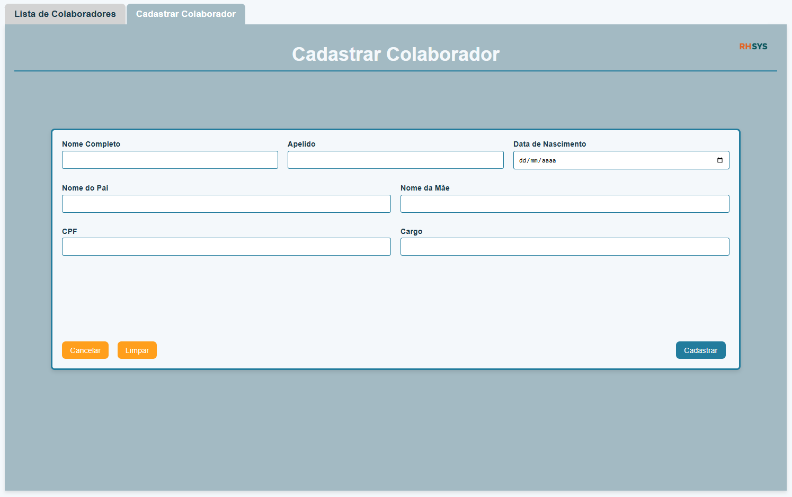
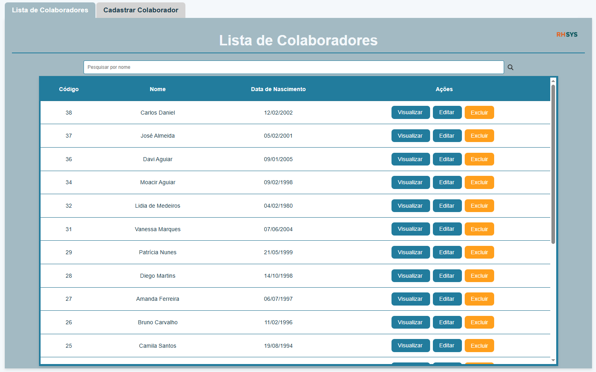

### Sistema de Gestão de Colaboradores:

Este projeto consiste em um sistema de gestão de colaboradores, desenvolvido para a empresa fictícia RHsys. O sistema foi projetado para gerenciar o cadastro, edição, visualização e exclusão de colaboradores de uma forma simples e eficiente. Foi utilizado Laravel no back-end e Nuxt.js no front-end, garantindo uma solução moderna e escalável para o gerenciamento de recursos humanos.

Tecnologias Utilizadas Laravel (Back-End): API RESTful para comunicação com o front-end. Validações de dados robustas para garantir a integridade da base de dados. Controle de rotas e autenticação segura para operações CRUD.

Nuxt.js (Front-End): Framework Vue.js utilizado para criar uma interface moderna e reativa. Implementação de filtros de pesquisa e barra de pesquisa para facilitar a navegação. Responsividade para uma ótima experiência de uso em dispositivos móveis.

Laragon (Ambiente de Desenvolvimento): Ambiente de desenvolvimento completo para Laravel, incluindo Apache, MySQL e PHP.

Funcionalidades Cadastro de Colaboradores: O sistema permite a inserção de novos colaboradores, com validações em tempo real para garantir dados corretos.

Edição e Exclusão: É possível editar as informações de um colaborador existente ou excluir registros indesejados.

Visualização de Detalhes: A página de visualização exibe as informações detalhadas do colaborador, sem a opção de editar.

Filtros de Pesquisa: Uma barra de pesquisa foi implementada na tela de listagem para facilitar a busca por colaboradores com base em diferentes critérios junto de filtros as colunas, podendo organizar os registros de diferentes formas.

Responsividade: O layout foi projetado para se ajustar automaticamente a qualquer dispositivo, seja desktop, tablet ou celular.

### Imagens do Projeto

#### Tela de Cadastro de Colaboradores
A tela de cadastro permite inserir os dados do colaborador e enviar para o back-end.

#### Tela de Lista de Colaboradores
Aqui, os colaboradores podem ser listados, filtrados, e opções de visualização, edição e exclusão estão disponíveis.

